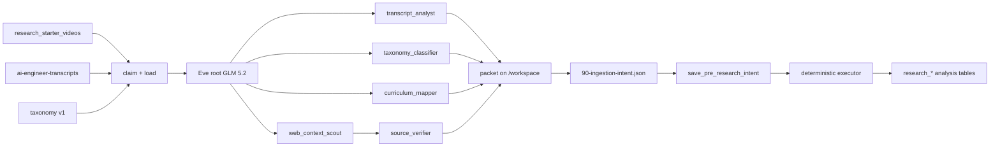

# Pre-research agent — implementation specification

**Status:** The v2 vertical slice is implemented. The primary operator path is the two-session pipeline. See [implementation/](./implementation/) and [implementation/goal/PRE_RESEARCH_V2_IMPLEMENTATION_PLAN.md](./implementation/goal/PRE_RESEARCH_V2_IMPLEMENTATION_PLAN.md). This file remains the original v1 contract.

This document is the contract for the next implementation team. The Eve project and Postgres schema already exist. Do not create a second agent directory. Do not reuse `research_ingestion_systems_agent`.

Source design: `../research_ingestion_systems_agent/pre-deep-research.md`.
Schema migration: `../supabase/migrations/20260815015402_research_pre_research_schema.sql`.
Zod source of truth: `contracts/`.

---

## 0. What is already done

| Item | Location | State |
| --- | --- | --- |
| Eve app | this directory, eve `0.38.3` | scaffolded |
| Model | `agent/agent.ts` | `zai/glm-5.2`, reasoning `medium` |
| Copy-agent disabled | `agent/tools/agent.ts` | `disableTool()` |
| Exa search | `agent/tools/web_search.ts` | `webSearch({ provider: "exa" })` |
| Workflow fan-out | `agent/tools/workflow.ts` | `maxSubagents: 6` |
| Claim RPC | `research_private.claim_pre_research_video` | live, 6-arg; `--video-id` cannot bypass qualification |
| Taxonomy v1 | 17 categories, 16 domains | live, status `active` |
| Intent bucket | `research-ingestion-intents` | private |
| Transcript lockdown | dropped `research_starter_videos` anon/authenticated SELECT | live |
| Skills | schema, taxonomy, filesystem, ingestion-intent | authored |
| Contracts | `contracts/*.ts` | authored |
| Durable packet tools | `save_research_phase_packet`, `load_research_phase_packet`, `save_pre_research_packet` | exist; prefix `pre-research/v2/<video_id>/<run_id>/` |
| Two-session controller | `controller/pre-research-pipeline.ts`, CLI `scripts/run-pre-research-pipeline.mjs` | research (`00`–`50`) then synthesis (`60`–`90`); controller owns the cutover |
| Executor | `executor/apply-intent.ts` | real; apply after synthesis; `pre_research_pipeline_finished` only after applied + hash-verified packet |

Eligible backlog at setup: **31** videos with `transcript_status = 'stored'`. About 1009 rows still have `none`.

---

## 1. System boundary



Core rule: **models propose facts. Deterministic code validates and persists them.**

The model never generates SQL and never chooses arbitrary tables or columns.

The existing deep-research agent stays untouched. It may later consume applied `research_video_analysis` rows.

---

## 2. Eve project rules

Read `node_modules/eve/docs/README.md` before changing Eve APIs. This project is eve `0.38.3`.

### Root config

Already set in `agent/agent.ts`:

- model `zai/glm-5.2`
- reasoning `medium`
- limits: 600k input / 60k output / 24h session

Do not add Firecrawl, Tavily, Context7, or Exa MCP connections. The free path is Eve `web_search` + AI Gateway + Exa.

### Tool surface

Root tools that exist:

| Tool | Purpose |
| --- | --- |
| `claim_pre_research_video` | `FOR UPDATE SKIP LOCKED` claim |
| `load_video_context` | metadata + transcript + sha256 |
| `load_taxonomy` | official enum definitions |
| `touch_pre_research_run` | lease + status |
| `save_pre_research_intent` | Zod validate + persist intent, no analysis writes |
| `record_web_search_event` | Exa search ledger |
| `web_search` | Exa via Gateway |
| `Workflow` | specialist fan-out only |
| `agent` | disabled |

Implement next:

1. Upload the full packet (00–90) to `research-ingestion-intents` from `save_pre_research_intent` or a sibling tool. Use the service role. Path: `pre-research/v1/<video_id>/<run_id>/`.
2. Finish `executor/apply-intent.ts` and invoke it from a **non-model** script or workflow after `intent_ready`.
3. Optional: `load_pre_research_packet` for crash recovery from storage.

### Filesystem agents

Every specialist and the root must use `/workspace` as a scratch pad. Layout is in `agent/skills/pre-research-filesystem/SKILL.md`.

Hosted `/workspace` is ephemeral. Durable copies go to:

- local `outputs/pre-research/` during `eve dev`
- bucket `research-ingestion-intents` in production

### Skills

| Skill | Who loads it |
| --- | --- |
| `pre-research-filesystem` | root + all specialists |
| `pre-research-schema` | root only (intent synthesis) |
| `pre-research-taxonomy` | root + `taxonomy_classifier` |
| `ingestion-intent` | root only |

Copy `pre-research-taxonomy` into `agent/subagents/taxonomy_classifier/skills/` if you want the child to load it without relying on the parent message. Skills are per-agent and do not inherit.

---

## 3. Official engineering categories

Postgres enum `research_engineering_category_code`. Changing a code requires a reviewed migration.

Seeded v1.0.0 (see `research_category_definition`):

1. model_foundations_behavior
2. inference_model_systems
3. ai_data_engineering
4. post_training_continual_learning
5. prompting_llm_programming
6. context_engineering_memory
7. retrieval_search_knowledge
8. agent_architecture_harnesses
9. tools_protocols_integrations
10. orchestration_durable_execution
11. coding_agents_software_engineering
12. evaluation_testing_benchmarking
13. observability_reliability_llmops
14. security_safety_identity_governance
15. multimodal_realtime_systems
16. ai_product_ux_human_factors
17. ai_platforms_developer_tooling

Application domains are lookup rows, not enums. Seeded codes include `general_purpose`, `coding_assistants`, `search_and_knowledge`, and the other rows in `research_application_domain`.

---

## 4. Tables

All new tables are `public.research_*` plus schema `research_private`. They are separate from aiengineerapp learner/entity tables. RLS is on; anon and authenticated have no policies and no grants. The agent uses `POSTGRES_URL` as a trusted server role.

### Read source

`research_starter_videos` — already existed. Fields that matter: `video_id`, `title`, `description`, `url`, `transcript_status`, `transcript_bucket`, `transcript_path`, `transcript_text`.

Anonymous SELECT on this table was removed because it exposed `transcript_text`.

### Written by this system

See `agent/skills/pre-research-schema/references/postgres-schema.md` for columns.

Claim uniqueness:

- one live run per `(video_id, transcript_sha256)`
- one applied run per `(video_id, transcript_sha256)`

If the transcript changes, the hash changes and a new run is allowed.

---

## 5. Subagents

Wave one, parallel:

```js
await Promise.all([
  tools.transcript_analyst({ message }),
  tools.taxonomy_classifier({ message }),
  tools.web_context_scout({ message }),
  tools.curriculum_mapper({ message }),
]);
```

Wave two:

```js
tools.source_verifier({ message: webContextCandidates });
```

| Subagent | Web | Output file |
| --- | --- | --- |
| transcript_analyst | disabled | 10-transcript-analysis.json |
| taxonomy_classifier | disabled | 20-taxonomy-classification.json |
| web_context_scout | Exa, 4–6 searches | 30-web-context.json |
| curriculum_mapper | disabled | 50-curriculum-signals.json |
| source_verifier | Exa | 40-source-verification.json |

Parent must put the full claim + video + taxonomy JSON in each child `message`. Children do not inherit history or the root sandbox.

`web_context_scout` and `source_verifier` must call `web_search` and `record_web_search_event`.

---

## 6. Intent file contract

Production packet:

```
research-ingestion-intents/pre-research/v1/<video_id>/<run_id>/
  00-run-manifest.json
  10-transcript-analysis.json
  20-taxonomy-classification.json
  30-web-context.json
  40-source-verification.json
  50-curriculum-signals.json
  90-ingestion-intent.json
  99-execution-receipt.json
```

Executor consumes only `90-ingestion-intent.json`.

Zod: `contracts/ingestion-intent.ts`.

Allowlisted kinds only:

- create_video_analysis
- replace_category_assignments
- replace_domain_assignments
- replace_lifecycle_assignments
- replace_evidence_anchors
- upsert_resource_candidates
- upsert_entity_candidates
- record_web_search_events

Never permit `{ "kind": "execute_sql" }`.

`idempotency_key` = SHA-256 of a canonical string:

```
video_id + transcript_sha256 + taxonomy_version + prompt_bundle_version + stable JSON of operations
```

---

## 7. Deterministic executor

Implement `executor/apply-intent.ts`. No model. No Eve session.

Algorithm:

1. Download `90-ingestion-intent.json` from `research-ingestion-intents`.
2. Parse with `ingestionIntentSchema`.
3. Verify file SHA-256 matches `research_ingestion_intent.content_sha256`.
4. Verify taxonomy version is `active` (or explicitly allowed).
5. Verify `research_starter_videos.video_id` exists.
6. Recompute SHA-256 of current `transcript_text`. If it differs, reject with `TRANSCRIPT_HASH_MISMATCH`. Do not summarize a new transcript under an old run.
7. `SELECT pg_advisory_lock(hashtext(intent_id::text))`.
8. If an intent with this `idempotency_key` is already `applied`, write a no-op receipt `already_applied` and return.
9. Open one transaction.
10. Apply allowlisted operations in declared order using `executor/operations.ts`.
11. Insert `research_ingestion_intent_event` rows.
12. Commit.
13. Mark intent `applied`, run `applied`.
14. Write `99-execution-receipt.json` locally and to the intent bucket.

Idempotency: applying the same intent twice must not create extra analysis meaning. `create_video_analysis` is insert-once on `run_id`. Replace operations delete-and-insert for that `analysis_id`.

URL normalization lives in `executor/url-normalization.ts`. Use it before writing `normalized_url`.

---

## 8. Claiming and concurrency

Do not use `ORDER BY ... OFFSET`.

`research_private.claim_pre_research_video`:

1. Expires stale `claimed`/`analyzing` leases (`LEASE_EXPIRED`).
2. Requires active taxonomy version.
3. Selects `transcript_status = 'stored'` with non-empty transcript and no live/applied run for that hash.
4. `FOR UPDATE SKIP LOCKED`.
5. Inserts `research_pre_research_run` with lease token.

Start dispatcher concurrency at **3**. Raise only after watching GLM and Exa rate limits.

The schedule `agent/schedules/process_next_video.ts` currently fires a markdown prompt every 30 minutes. Replace it with a handler that claims N videos and starts one Eve session per video if you need a real backlog worker.

---

## 9. Transcript summary rules

`initial_summary`: 75–125 words, transcript only.

`structured_summary`: 200–400 words, transcript grounded.

Also required: 5–10 takeaways, concepts, architecture/workflow, demos, quantitative claims, limitations, prerequisites, learning outcomes, section anchors.

Evidence grades must stay explicit:

- said_in_transcript
- inferred_from_transcript
- verified_external
- unverified_external

Do not put raw transcripts in intent files.

---

## 10. Security

Already done:

- RLS on all new `research_*` tables, no client policies
- `research_private` functions executable only by `postgres` / `service_role`
- `research_starter_videos` no longer readable by anon/authenticated
- intent bucket private, no client storage policies

Still required:

- Secrets only in Eve runtime env, never the model sandbox
- Do not log `lease_token` or `transcript_text` to client channels
- Copy `.env.example` locally; never commit `.env`
- Do not restore a public view over `transcript_text`

---

## 11. Evaluation gates

Before the full catalog:

1. Build a 40–50 video stratified golden set, including cross-category talks.
2. Require exactly one primary category.
3. Limit secondary categories to three.
4. Reject unknown enum values (Zod already does this).
5. Require evidence ids on resources and entities.
6. Assert `web_context_scout` and `source_verifier` called `web_search`.
7. Reject unverified official-repository claims.
8. Test `TRANSCRIPT_HASH_MISMATCH`.
9. Apply every test intent twice; prove idempotency.
10. Measure classification stability across repeated runs.
11. Human review when `overall_confidence < 0.70`.

Add Eve evals under `evals/` once the executor exists.

---

## 12. Implementation order

1. Storage upload of the full packet (00–99).
2. `apply-intent.ts` + a `scripts/apply-intent.ts` CLI.
3. Wire dispatcher: claim → Eve session → wait for `intent_ready` → apply.
4. Copy taxonomy skill onto `taxonomy_classifier`.
5. Smoke test 10 stored videos.
6. Golden set of 50.
7. Curriculum-core ~150.
8. Audit category distribution and Exa search quality via `research_web_search_event`.
9. Remainder of stored transcripts.
10. Hand applied rows to the deep-research agent.

---

## 13. Environment

```
AI_GATEWAY_API_KEY
POSTGRES_URL
POSTGRES_URL_NON_POOLING
SUPABASE_URL
SUPABASE_SERVICE_ROLE_KEY
```

Do **not** set `EXA_API_KEY`.

---

## 14. Acceptance checklist for the implementing team

- [ ] `npm run typecheck` passes
- [ ] `claim_pre_research_video` returns a stored video and a lease
- [ ] Claiming the same video twice while the run is live returns a different video or `NO_ELIGIBLE_VIDEO`
- [ ] Root writes all packet files to `/workspace/pre-research/<video_id>/<run_id>/`
- [ ] `web_search` provider is Exa; search events are logged
- [ ] `save_pre_research_intent` rejects unknown operation kinds
- [ ] Executor applies one intent and is a no-op on the second apply
- [ ] Transcript hash mismatch rejects
- [ ] No writes to `youtube_video`, `course`, `person`, or other app tables
- [ ] GLM 5.2 remains the only model id

The pre-research output is a versioned research packet, not a mutation of the eventual curriculum or canonical entity graph. Deeper research may correct, merge, promote, or reject these starter findings without losing provenance.
